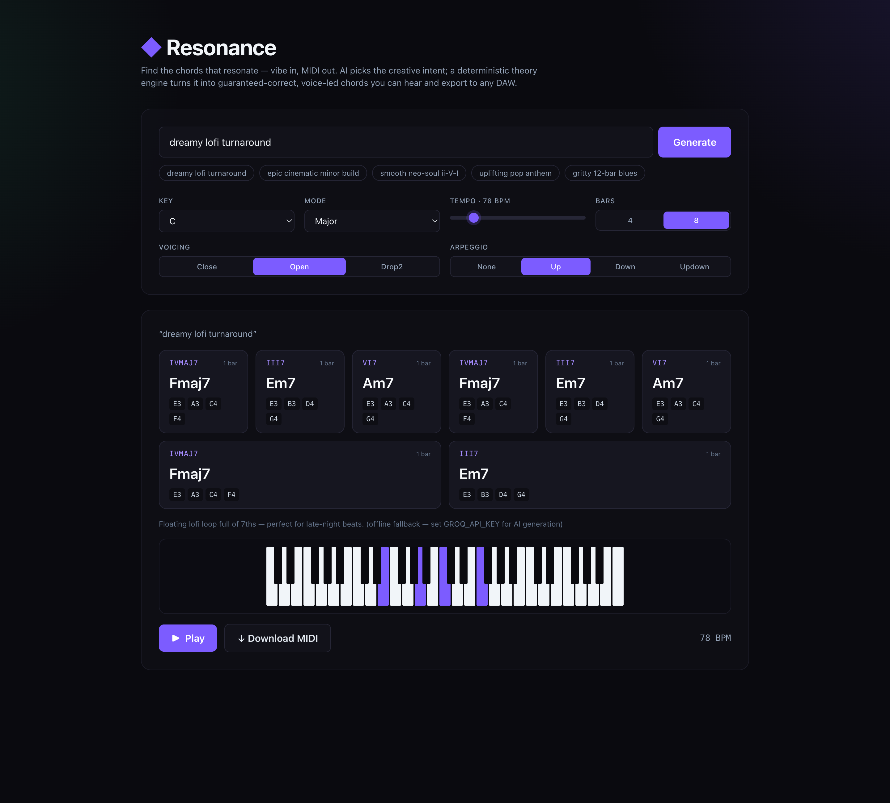

# Resonance

*by Terra Echo Studios — find the chords that resonate.*

An AI-assisted chord-progression generator for music producers. Describe a vibe in
plain language ("dreamy lofi turnaround", "epic cinematic minor build"), pick a
key/mode/tempo, and get a **musically-correct** progression you can **hear** in the
browser and **export as MIDI** for any DAW.



## Architecture: AI intent, deterministic theory

The core principle — **music theory is deterministic; the LLM only supplies creative
intent**:

- The **LLM (Groq)** takes your vibe + key/mode and returns a **structured JSON spec**:
  chords as **Roman numerals** with explicit extensions (`ii7`, `V9`, `Imaj7`, `bVII`,
  `V/vi`), plus tempo, voicing style and arpeggiation. **It never returns raw notes.**
- A **deterministic TypeScript theory engine** (`lib/theory/`) converts that spec into
  guaranteed-correct MIDI notes, applies voicings and a voice-leading optimizer, and
  drives playback + MIDI export.

This guarantees every output is valid and playable, and degrades gracefully: a
**deterministic fallback** generator (a curated, tagged template library) runs whenever
the LLM is unavailable, rate-limited (HTTP 429), or returns invalid JSON. **The app works
with no API key at all.**

```
Vibe ──▶ Groq LLM ──▶ JSON spec (Roman numerals) ──▶ zod validation
                                                          │
                          deterministic fallback ◀────────┘ (on 429 / invalid / no key)
                                   │
                                   ▼
                 Theory engine: resolve romans ▶ build chords ▶ voice-lead
                                   │
                       ┌───────────┴───────────┐
                       ▼                       ▼
                 Tone.js playback        @tonejs/midi export
```

## Tech stack

- **Next.js 14 (App Router)** + **TypeScript (strict)** + **Tailwind CSS**
- **`tonal`** — music-theory primitives (cross-checked against hand-written formula tables)
- **`tone`** — in-browser audio playback
- **`@tonejs/midi`** — MIDI export
- **`openai`** SDK pointed at **Groq's** OpenAI-compatible endpoint
- **`zod`** — structured-output validation
- Backend is a single Next.js **route handler** (`app/api/generate/route.ts`). All Groq
  calls happen server-side; the API key never reaches the client.

## Setup

```bash
npm install
cp .env.example .env.local      # then add your key (optional)
npm run dev                     # http://localhost:3000
```

Get a free Groq key (no credit card) at <https://console.groq.com/keys> and put it in
`.env.local`:

```
GROQ_API_KEY=gsk_...
```

Without a key, the app still runs fully on the deterministic fallback library.

### Scripts

- `npm run dev` — start the dev server
- `npm run build` — production build (strict TypeScript)
- `npm test` — run the theory unit tests (Vitest)

## How the fallback works

`lib/theory/progressions.ts` holds a curated library of Roman-numeral progressions tagged
by mood/genre (pop, jazz, blues, lofi/neo-soul, cinematic minor, modal). The fallback
matches your vibe text against those tags and picks the best template, then realizes it
through the same theory engine. Triggers:

- `GROQ_API_KEY` is unset (`no-api-key`)
- Groq returns HTTP **429** (`rate-limited`)
- The model returns invalid JSON twice (after one correction retry)
- Any network/error path

The UI shows a badge indicating whether the result came from the **AI** or the
**deterministic fallback**.

## The theory engine

- `scales.ts` — pitch/MIDI helpers + scale interval tables (12 modes/scales)
- `chords.ts` — chord interval formulas + `buildChord(rootMidi, quality)`
- `romanNumerals.ts` — Roman-numeral resolver: accidentals (`bVII`), explicit
  extensions, diatonic defaults per mode, and secondary dominants (`V/vi`)
- `voicing.ts` — close / open / drop-2 voicings + a **voice-leading optimizer** that
  minimizes total semitone movement between chords
- `progressions.ts` — curated fallback templates
- `realize.ts` — ties it together: spec ▶ `RealizedChord[]`

Roman numerals use the **scale-degree convention**: a numeral names the degree within the
active mode's own scale (so `III` in a minor key is the natural mediant, and `bVII` in a
major key is the borrowed sub-tonic). Unit tests in `__tests__/theory.test.ts` cover
`buildChord` against the formula tables, Roman-numeral resolution (including borrowed
`bVII` and the secondary dominant `V/vi`), and the voice-leading optimizer.
